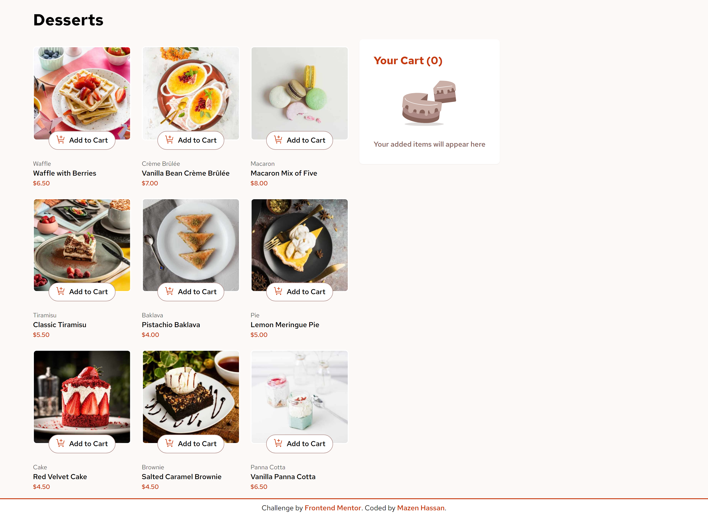
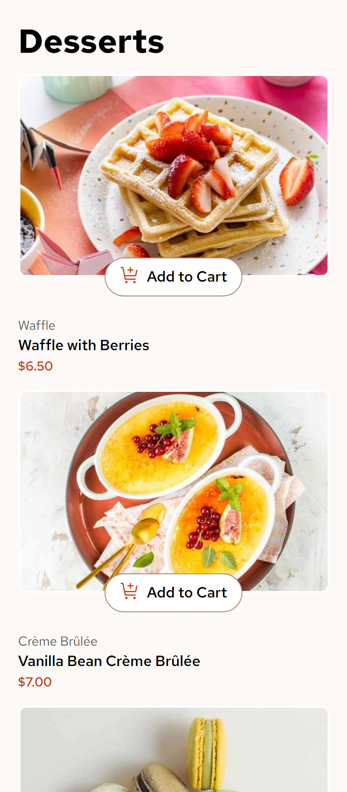

# Frontend Mentor - Product list with cart solution

This is a solution to the [Product list with cart challenge on Frontend Mentor](https://www.frontendmentor.io/challenges/product-list-with-cart-5MmqLVAp_d). Frontend Mentor challenges help you improve your coding skills by building realistic projects.

## Table of contents

- [Frontend Mentor - Product list with cart solution](#frontend-mentor---product-list-with-cart-solution)
  - [Table of contents](#table-of-contents)
    - [The challenge](#the-challenge)
    - [Screenshot](#screenshot)
    - [Links](#links)
    - [Built with](#built-with)
    - [What I learned](#what-i-learned)
    - [Continued development](#continued-development)
    - [Useful resources](#useful-resources)
  - [Author](#author)
  - [Acknowledgments](#acknowledgments)

### The challenge

Users should be able to:

- Add items to the cart and remove them
- Increase/decrease the number of items in the cart
- See an order confirmation modal when they click "Confirm Order"
- Reset their selections when they click "Start New Order"
- View the optimal layout for the interface depending on their device's screen size
- See hover and focus states for all interactive elements on the page

### Screenshot





### Links

- Solution URL: [Solution URL](https://www.frontendmentor.io/solutions/product-list-with-cart-using-react-tailwind-9Z8buG9Sg1)
- Live Site URL: [Live site URL](https://github.com/Mazz100/Product-list-with-cart/tree/24af2307f235541eb62102f2231206e0d2a4bf4f)

### Built with

- Semantic HTML5 markup
- CSS custom properties
- Flexbox
- CSS Grid
- Mobile-first workflow
- [React](https://reactjs.org/) - JS library
- [Radix UI](https://www.radix-ui.com/primitives/docs/components/dialog) - Component UI
- [React Spring](https://react-spring.dev/docs) - React animation library
- [Tailwind CSS](https://tailwindcss.com/docs/installation) - CSS framework

### What I learned

In this challenge I learned some valuable techniques and React ways of doing things. Most important points are:

- Utilizing map array function with the product component as a child, making it easier for passing props and functions through parent component `App.jsx`.
- The importance of using previous state to update a dynamic arrays of objects with it's latest state and prevent potential bugs when updating UI really quick.
- Destructuring `{}` arguments passed to functions and when, how it's used in such cases.
- Learned to focus the logic and state setters all inside one component which is `App.jsx` and not passing the setter as a prop, if another component has a logic of it's own we can then create a new state for it.
- Never duplicate states as much as possible and instead create a normal variable which access the state properties such as `cartItems.length` to get total of array.
- Not to be too quick on deciding to go with `useContext` hook and not worrying about passing props unless it gets complicated, it will always depend.
- I learned a proper HTML structure for basic shopping cart feature and really liked the number input which enables users to manually insert a quantity.
- Learned `Number` JavaScript function that converts and returns a number of any kind.

```html
<!-- Basic shopping cart with input for controlling quantity by user -->
<div
  className="flex -translate-y-1/2 items-center justify-center gap-6 rounded-full bg-primary-color p-3 transition-colors duration-500"
>
  <button
    onClick="{decrement}"
    aria-label="decrement quantity"
    className="group aspect-auto rounded-full border-2 border-border-color-veryLight p-1 transition-colors duration-150 hover:bg-white focus-visible:outline-[1px] focus-visible:outline-offset-[5px] focus-visible:outline-white"
  >
    <svg
      className="aspect-square"
      xmlns="http://www.w3.org/2000/svg"
      width="10"
      height="10"
      fill="none"
      viewBox="0 0 10 2"
      aria-hidden="{true}"
    >
      <path
        className="group-hover:fill-primary-color"
        fill="#fff"
        d="M0 .375h10v1.25H0V.375Z"
      />
    </svg>
  </button>
  <input
    className="no-arrows block h-full max-w-16 rounded-md bg-transparent text-center text-white transition-colors duration-150 focus-visible:outline-[1px] focus-visible:outline-white"
    type="number"
    name="product quantity"
    value="{product.quantity}"
    onChange="{(e)"
    =""
  />
  { const newQuantity = Number(e.target.value);
  onUpdateQuantity(product.quantity >= 999 ? 1 : newQuantity); } autoFocus
  aria-label={`${product.name} with ${product.quantity} quantity`} />

  <button
    onClick="{increment}"
    aria-label="increment quantity"
    className="group aspect-auto rounded-full border-2 border-border-color-veryLight p-1 transition-colors duration-150 hover:bg-white focus-visible:outline-[1px] focus-visible:outline-offset-[5px] focus-visible:outline-white"
  >
    <svg
      className="aspect-square w-full"
      xmlns="http://www.w3.org/2000/svg"
      width="10"
      height="10"
      fill="none"
      viewBox="0 0 10 10"
      aria-hidden="{true}"
    >
      <path
        className="group-hover:fill-primary-color"
        fill="#fff"
        d="M10 4.375H5.625V0h-1.25v4.375H0v1.25h4.375V10h1.25V5.625H10v-1.25Z"
      />
    </svg>
  </button>
</div>
```

```js
//Directly passing props to React components and make it easier to trigger functions and retrieve product data directly
<ul className="Tablet:grid Tablet:grid-cols-2 Tablet:gap-6 Desktop:grid-cols-3 Desktop:gap-6">
  {productWithQuantity.map((product) => (
    <ProductList
      key={product.name}
      product={product}
      onAddToCart={() => addCartItem({ product })}
      onUpdateQuantity={(newQuantity) =>
        updateQuantity(product.name, newQuantity)
      }
    />
  ))}
</ul>;

// Destructuring product data passed to function
function addCartItem({ product }) {
  setCartItems((prevCartItems) => [
    ...prevCartItems,
    { ...product, quantity: 1 },
  ]);
}
```

### Continued development

I am willing to improve my decision making and reading docs more often and have a breakdown of what is required to accomplish a certain task. Taking the process a step-by-step and not rushing through it.

I want to leverage my skills in React and think in a more React way of implementing things.

### Useful resources

- [Cart Feature on dev.to](https://dev.to/anne46/cart-functionality-in-react-with-context-api-2k2f) - I got a nice read on this article it helped me understand a basic implementation of shopping cart feature but I decided to go only with props, it's a great article I recommend for anyone.

## Author

- Website - [Mazen Hassan](https://mazen-hassan-portfolio.vercel.app/)
- Frontend Mentor - [@Mazz100](https://www.frontendmentor.io/profile/Mazz100)

## Acknowledgments

Really thankful and grateful for the detailed and thourough guidance I got on Discord community, I learned a lot and looking forward to discover new techniques and tips.
